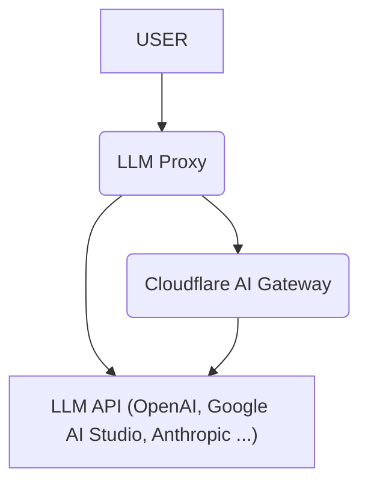

# LLM Proxy on Cloudflare Workers

A serverless proxy running on [Cloudflare Workers](https://www.cloudflare.com/developer-platform/products/workers/) that integrates multiple Large Language Model (LLM) APIs.

Inspired by [LiteLLM](https://github.com/BerriAI/litellm).

## Features

- **Centralized API Key Management:** Manage all your LLM API keys in one place.
- **Pass-through Endpoints:** Forward requests to any LLM API with minimal changes. (Examples: `/openai/chat/completions`, `/google-ai-studio/v1beta/models/gemini-1.5-pro:generateContent`)
- **OpenAI-Compatible Endpoints:** Supports standard OpenAI endpoints for easy integration with existing tools and libraries.
  - `/v1/chat/completions`
  - `/v1/models`
- **Cloudflare AI Gateway Integration:** Supports [Cloudflare AI Gateway](https://www.cloudflare.com/developer-platform/products/ai-gateway/), including its [Universal Endpoint](https://developers.cloudflare.com/ai-gateway/providers/universal/). This allows for logging, analytics, and other features offered by AI Gateway.



## Supported Providers

| Name             | Support | AI Gateway Support | Pass-Through Routes | Environment Variable                         |
| ---------------- | ------- | ------------------ | ------------------- | -------------------------------------------- |
| OpenAI           | ✅      | ✅                 | `openai`            | `OPENAI_API_KEY`                             |
| Google AI Studio | ✅      | ✅                 | `google-ai-studio`  | `GEMINI_API_KEY`                             |
| Anthropic        | ⚠️      | ✅                 | `anthropic`         | `ANTHROPIC_API_KEY`                          |
| Cohere           | ⚠️      | ✅                 | `cohere`            | `COHERE_API_KEY`                             |
| Grok             | ✅      | ✅                 | `grok`              | `GROK_API_KEY`                               |
| Groq             | ✅      | ✅                 | `groq`              | `GROQ_API_KEY`                               |
| Mistral          | ✅      | ✅                 | `mistral`           | `MISTRAL_API_KEY`                            |
| Perplexity       | ❌      | ❌                 | `perplexity`        |                                              |
| Azure OpenAI     | ❌      | ❌                 | `azure-openai`      |                                              |
| Vertex AI        | ❌      | ❌                 | `google-vertex-ai`  |                                              |
| Amazon Bedrock   | ❌      | ❌                 | `aws-bedrock`       |                                              |
| OpenRouter       | ✅      | ✅                 | `openrouter`        | `OPENROUTER_API_KEY`                         |
| Workers AI       | ✅      | ✅                 | `workers-ai`        | `CLOUDFLARE_ACCOUNT_ID` `CLOUDFLARE_API_KEY` |
| HuggingFace      | ❌      | ❌                 | `huggingface`       |                                              |
| Replicate        | ❌      | ❌                 | `replicate`         |                                              |

Providers marked with ⚠️ have limited support for certain features (e.g., Tool Use, multimodal capabilities).

## Quick Start

1. Clone this repository.
2. Install dependencies with `npm install`.
3. Run `npm run deploy` to deploy the Cloudflare Worker.
4. Run `npx wrangler secret put <ENVIRONMENT_VARIABLE_NAME>` to securely set environment variables for your Cloudflare Worker. (Examples: `npx wrangler secret put PROXY_API_KEY`, `npx wrangler secret put OPENAI_API_KEY`). See the "Environment Variables" section for a list of required variables.

## Environment Variables

### Required:

- `PROXY_API_KEY`: API key used to authenticate requests to your LLM Proxy server. You can use any string as the key.

### AI Gateway:

If integration with Cloudflare AI Gateway is required, set the following environment variables.

- `CLOUDFLARE_ACCOUNT_ID`: Your Cloudflare account ID.
- `AI_GATEWAY_NAME`: Name of your AI Gateway.
- `CF_AIG_TOKEN`: (Optional) Authentication token for your AI Gateway.

### Provider API Keys

Set the API key for the provider you are using. API keys can be a single string, a comma-separated string, or a JSON-formatted string array.

- `OPENAI_API_KEY`: OpenAI API key.
- `GEMINI_API_KEY`: Google AI Studio API key.
- `ANTHROPIC_API_KEY`: Anthropic API key.
- `COHERE_API_KEY`: Cohere API key.
- `GROK_API_KEY`: Grok API key.
- `GROQ_API_KEY`: Groq API key.
- `MISTRAL_API_KEY`: Mistral API key.
- `OPENROUTER_API_KEY`: OpenRouter API key.
- `CLOUDFLARE_ACCOUNT_ID`: Cloudflare account ID.
- `CLOUDFLARE_API_KEY`: Cloudflare API key (required for Workers AI).

### Proxy Configuration:

- `RETRY`: The number of retry attempts for failed requests to the LLM provider via AI Gateway. Defaults to 0 (no retries). Only applicable when using AI Gateway.

## Usage Example

To use the proxy, send your requests to the deployed Cloudflare Worker URL with the appropriate route and API key.

### OpenAI-Compatible Endpoints

These endpoints are designed to be compatible with the OpenAI API.

#### cURL

```bash
curl https://your-worker-url/v1/models \
  -H "Authorization: Bearer $PROXY_API_KEY" \
  -H "Content-Type: application/json"
```

```bash
curl -X POST https://your-worker-url/v1/chat/completions \
  -H "Authorization: Bearer $PROXY_API_KEY" \
  -H "Content-Type: application/json" \
  -d '{
    "model": "openai/gpt-4o",
    "messages": [{"role": "user", "content": "Hello, world!"}]
  }'
```

#### Python (OpenAI SDK)

```Python
from openai import OpenAI

client = OpenAI(
    api_key="PROXY_API_KEY",
    base_url="https://your-worker-url"
)
models = client.models.list()
for model in models.data:
    print(model.id)
```

```python
from openai import OpenAI

client = OpenAI(
    api_key="PROXY_API_KEY",
    base_url="https://your-worker-url"
)
response = client.chat.completions.create(
    model: "google-ai-studio/gemini-1.5-pro",
    messages: [{ "role": "user", "content": "Hello, world!" }],
)

print(response.choices[0].message.content)
```

### Pass-through Endpoints

These endpoints allow you to directly forward requests to the LLM provider's API.

#### cURL

```bash
curl -X POST https://your-worker-url/openai/chat/completions \
  -H "Authorization: Bearer $PROXY_API_KEY" \
  -H "Content-Type: application/json" \
  -d '{
    "model": "gpt-4o",
    "messages": [{"role": "user", "content": "Hello, world!"}]
  }'
```

```bash
curl -X POST https://your-worker-url/google-ai-studio/v1beta/models/gemini-1.5-pro:generateContent \
  -H "Authorization: Bearer $PROXY_API_KEY" \
  -H "Content-Type: application/json" \
  -d '{
    "contents": [{"role": "user", "parts": [{"text": "Hello, world!"}]}]
  }'
```
