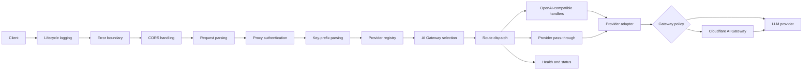

# Architecture Overview

## Scope

The Worker presents one authenticated edge endpoint for multiple LLM APIs. It
supports OpenAI-compatible Chat Completions, Responses, Anthropic-compatible
Messages, model aggregation, provider-specific pass-through, and Cloudflare AI
Gateway routes.

User-facing commands and endpoint examples live in the
[documentation index](../index.md). Architecture and scope follow the
[project principles](../project-principles.md).

## Request flow

The Worker stores the active `Env` in request-scoped `AsyncLocalStorage` so
configuration helpers do not depend on mutable module-level request state.
Multi-key rotation uses striped per-isolate round-robin.
Provider and proxy credentials are kept separate when requests are
forwarded.

## Design boundaries

- The proxy is an adapter and router, not a complete normalization layer for
  every provider feature.
- Pass-through routes deliberately preserve provider-specific contracts.
- Model aggregation and status checks are best-effort diagnostics, not
  transactional health guarantees.
- AI Gateway supplies gateway concerns such as analytics and caching; this
  Worker constructs and authenticates Gateway requests but does not reproduce
  those features.
- JSONC files are local inputs. Production configuration reaches the Worker as
  secret environment bindings.

## Detailed design

### Request processing

- [Request processing](features/request-processing.md)
- [Security and configuration](features/security_config.md)

### Provider behavior and reliability

- [Native inference endpoint selection](features/native_inference.md)

- [Provider abstraction](features/provider_abstraction.md)
- [Key rotation](features/key_rotation.md)
- [Virtual models](features/virtual_models.md)

### Cloudflare integration and diagnostics

- [AI Gateway integration](features/ai_gateway.md)
- [Monitoring and diagnostics](features/monitoring_diagnostics.md)
- [Request-path performance](features/performance.md)

## Authoritative implementation points

| Concern                         | Source                       |
| ------------------------------- | ---------------------------- |
| Middleware order                | `src/index.ts`               |
| Route table                     | `src/routing.ts`             |
| Route execution                 | `src/middlewares/router.ts`  |
| Built-in providers              | `src/providers.ts`           |
| Configuration shape             | `schemas/config-schema.json` |
| Worker bindings and migrations  | `wrangler.jsonc`             |
| Secret and key-selection policy | `src/utils/secrets.ts`       |
