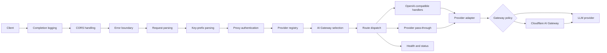

# Architecture Overview

## Scope

The Worker presents one authenticated edge endpoint for multiple LLM APIs. It
supports three request styles: OpenAI-compatible chat and model routes,
provider-specific pass-through routes, and Cloudflare AI Gateway routes.

This documentation describes the current implementation. User-facing commands
and endpoint examples live in the [documentation index](../index.md). Design and
roadmap decisions follow the [project principles](../project-principles.md).

## Request flow

The Worker stores the active `Env` in request-scoped `AsyncLocalStorage` so
configuration helpers do not depend on mutable module-level request state.
Multi-key rotation uses striped per-isolate round-robin.
Provider and proxy credentials are kept separate when requests are
forwarded.

## Design boundaries

- The proxy is an adapter and router, not a complete normalization layer for
  every provider feature.
- Pass-through routes deliberately preserve provider-specific contracts.
- Model aggregation and status checks are best-effort diagnostics, not
  transactional health guarantees.
- AI Gateway supplies gateway concerns such as analytics and caching; this
  Worker constructs and authenticates Gateway requests but does not reproduce
  those features.
- JSONC files are local inputs. Production configuration reaches the Worker as
  secret environment bindings.

## Detailed design

### Request processing

- [Middleware pipeline](features/middleware_pipeline.md)
- [Path handling and normalization](features/path_handling.md)
- [Security and configuration](features/security_config.md)

### Provider behavior and reliability

- [Provider abstraction](features/provider_abstraction.md)
- [Custom OpenAI-compatible endpoints](features/custom-openai-endpoints.md)
- [Key rotation](features/key_rotation.md)
- [Provider credential profiles](features/provider_profiles.md)
- [Virtual models](features/virtual_models.md)
- [Chat response metadata](features/chat-response-metadata.md)

### Cloudflare integration and diagnostics

- [AI Gateway integration](features/ai_gateway.md)
- [Monitoring and diagnostics](features/monitoring_diagnostics.md)
- [Request-path performance](features/performance.md)

### Security decisions

- [Security design decisions](security-decisions.md) — intentional behaviors and
  accepted risks, with rationale and reconsideration conditions.

## Authoritative implementation points

| Concern                         | Source                       |
| ------------------------------- | ---------------------------- |
| Middleware order                | `src/index.ts`               |
| Route table                     | `src/middlewares/router.ts`  |
| Built-in providers              | `src/providers.ts`           |
| Configuration shape             | `schemas/config-schema.json` |
| Worker bindings and migrations  | `wrangler.jsonc`             |
| Secret and key-selection policy | `src/utils/secrets.ts`       |
